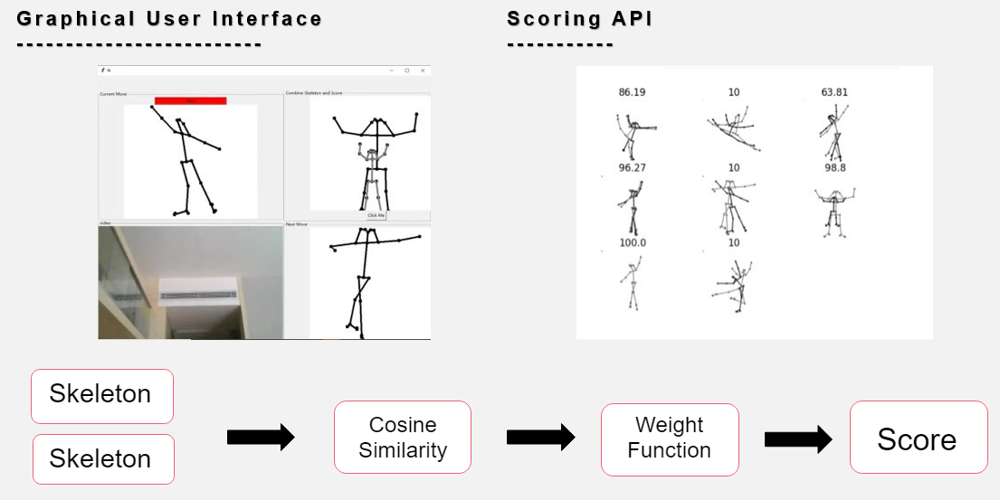

# Dance Game Engine
[Arthur Murray Dance Studio](https://arthurmurray.com/)     ~~~~~~~~~~~~~~~~   [Our Blog](https://medium.com/ucl-comp0016-2020-team13) ~~~~~~~~~~~~~~ [Our Website](http://students.cs.ucl.ac.uk/2020/group13/)

- [Dance Game Engine](#dance-game-engine)
  * [Abstract](#abstract)
  * [Key Features](#key-features)
    + [Graphical User Interface](#graphical-user-interface)
    + [Preprocessing Image](#preprocessing-image)
    + [Multi Platform](#multi-platform)
  * [Installation Guide](#installation-guide)
    + [Python Package Dependencies](#python-package-dependencies)
    + [For MacOS Users](#for-macos-users)
    + [For Windows 10 Users](#for-windows-10-users)
  * [User Manual For Both MacOS and Win10 Users](#user-manual-for-both-macos-and-win10-users)
  * [Legal Issue](#legal-issue)
    + [Legal Statement](#legal-statement)
    + [Data Privacy Consideration](#data-privacy-consideration)
    + [Credits](#credits)

## Abstract

Aimed at helping inexperienced dancers to learn basic dancing moves and gain interests in dancing, we worked with Arthur Murray Dance Studio to develop a video game engine. We provide a graphical frontend that prompts users to follow the example moves shown on screen, and it gives feedback by querying the set of APIs developed by our team, which extract skeletal information from images and evaluate the similarity between the example and that of the users. We performed pose estimation with the OpenPose system developed by CMU. The similarity score between two skeletons is calculated using a heuristically-determined one-variable function with the skeletons' cosine similarity as input. Both the graphical frontend and the set of APIs are designed to be modular and extendible, providing large potential for enhancement and extension of the game itself, and to other fields where it may fit.

## Key Features
### Graphical User Interface
We provide a graphical frontend that prompts users to imitate the example moves shown on the screen. The set of APIs are called under the hood of a gaming GUI, to evaluate the users' postures against the examples, giving a similarity score as output. Both the GUI and API layers serve as interfaces to users, which could be dancers or developers, depending on the context for which they like to use the system. The similarity score between two skeletons is calculated using a heuristically determined one-variable function with the skeletons' cosine similarity as input. We show the similarity of 10 sets of images. We also show the same evaluation routine embedded within the GUI.

### Preprocessing Image

We support a routine to preprocess images, save the skeletons locally, and set the basis to reconstruct example dance videos into cleaner, more polished, and more flexible stick-figure based forms.

### Multi Platform
The system is deployable across MacOS, Windows, and Linux. It only requires a PC equipped with webcams, as found in ordinary households; no other additional hardware is required.

## Installation Guide
### Python Package Dependencies
Install packages for python:

Numpy, matplotlib, opencv
 
`pip install numpy`

`pip install matplotlib`

`pip install opencv-python`
### For MacOS Users
[Installation Guide For Mac](docs/readmeFiles/MacOSinstallGuide.md)

### For Windows 10 Users
[Installation Guide For Win10](docs/readmeFiles/Win10installGuide.md)

## User Manual For Both MacOS and Win10 Users
[User Manual](docs/readmeFiles/UserMaunal.md)

## Legal Issue

### Legal Statement
The software is an early proof of concept for development purposes and should not be used as-is in a live environment without further redevelopment and/or testing. No warranty is given and no real data or personally identifiable data should be stored. Usage and its liabilities are your own.

### Data Privacy Consideration
The data we used in our system are all pictures. The pictures shown when you run the python files in openpose/examples/tutorial_api_python and stored in openpose/examples/media are downloaded when we cloned openpose github repository. Other pictures in COMP0016_2020_21_Team13/testing/integrationTesting/scoring/data are screenshoted from videos in Youtube. All of these data are used only to see if the skeleton finding and skeleton matching algorithms are working correctly. Our game runs a local copy and will not store any user data or images but only process them on runtime.

The pictures shown on our website are screenshoted from the following websites:

https://www.bilibili.com/video/BV1PK4y1Y7jt?t=56&p=2

https://www.youtube.com/watch?v=kbM5aK-M82g&list=RDkbM5aK-M82g&index=1

https://www.youtube.com/watch?v=MOwaUlXZxkI

https://github.com/CMU-Perceptual-Computing-Lab/openpose

https://github.com/CMU-Perceptual-Computing-Lab/openpose/blob/master/doc/00_index.md

The other pictures of graphs on our website are drawn by ourselves.

If you have any problems with the pictures please contact us.

Software Licences
This project incorporates material from the project(s) listed below.

1. CMU-Perceptual-Computing-Lab/openpose (https://github.com/CMU-Perceptual-Computing-Lab/openpose)

COPYRIGHT: The Software is owned by Licensor and is protected by United States copyright laws and applicable international treaties and/or conventions.

[licence type: SOFTWARE LICENSE AGREEMENT.](https://github.com/CMU-Perceptual-Computing-Lab/openpose/blob/master/LICENSE)

2. Tkinter

[licence type: MIT](https://github.com/PacktPublishing/Python-GUI-Programming-with-Tkinter/blob/master/LICENSE).

3. Matplotlib

[licence type: PSF](https://matplotlib.org/stable/users/license.html).

4. Python 3.7.1

[licence type: PSF](https://docs.python.org/3.7/license.html#psf-license-agreement-for-python-release)

5. PIL

[licence type: HPND](https://github.com/python-pillow/Pillow/blob/master/LICENSE).

6. Numpy
   
[licence type: BSD 3-Clause "New" or "Revised" License](https://github.com/numpy/numpy/blob/main/LICENSE.txt).

7. Opencv

[license type: Apache License](https://github.com/opencv/opencv/blob/master/LICENSE).

### Credits
System developed by Zhichen Xu, Jianping Huang, Qianhui Zhang.
Clients and organisations Arthur Murray Dance Studio, Adrian Persad, Shaun Persad.
Supervisors and Teaching Assistants Dr Yun Fu, An Zhao.
University College London

