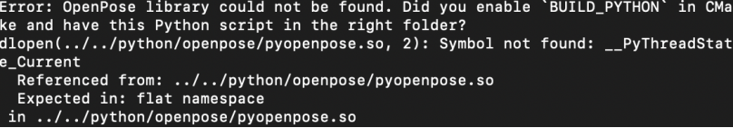

# Installation Guide For MacOS

- [Installation Guide For MacOS](#installation-guide-for-macos)
  * [Create parent directory](#create-parent-directory)
  * [Clone team 13 repository under danceGame directory](#clone-team-13-repository-under-dancegame-directory)
  * [Install openpose](#install-openpose)
    + [Clone openpose repository under danceGame directory](#clone-openpose-repository-under-dancegame-directory)
    + [Install prerequisites](#install-prerequisites)
    + [Build with Cmake](#build-with-cmake)
    + [Compilation](#compilation)
    + [Running openpose](#running-openpose)
- [Running the game](#running-the-game)

##   Create parent directory
Create directory at desired location, name it "danceGame"

    mkdir danceGame
##   Clone team 13 repository under danceGame directory

    cd danceGame

    git clone https://github.com/UCLComputerScience/COMP0016_2020_21_Team13
##  Install openpose
[Official installation instructions: ](https://github.com/CMU-Perceptual-Computing-Lab/openpose/blob/master/doc/installation/0_index.md)
###  Clone openpose repository under danceGame directory

    git clone https://github.com/CMU-Perceptual-Computing-Lab/openpose
###  Install prerequisites
cd into the openpose folder:

    cd openpose

Note: As for now, cmake has to be installed using brew install --cask cmake
###  Build with Cmake

    cd {openpose_folder}
   (Note: this may be unnecessary if you are still under the same folder as from section 3.2)
   

    mkdir build/

    cd build/
    
    cmake-gui ..
   Verify the location of installation.

   

   Press configure, use Xcode as generator.

   

   Enable BUILD_PYTHON and configure again.

   

   Set GPU_MODE and configure again.

   

   If Configuring done appears, then press Generate.

   

   Generating done will appear below, and you can close CMake.

   

###  Compilation

    cd build/
   (Note: this may be unnecessary if you are still under the same folder as from section 3.3)
   

    make -j`sysctl -n hw.logicalcpu`
   Note: I faced the problem Could NOT find vecLib (missing: vecLib_INCLUDE_DIR), and I had to manually install Caffe.
   
###  Running openpose
  Running the openpose executable:
  

      
    cd openpose/
    ./build/examples/openpose/openpose.bin --image_dir examples/media/
   

   [Running the python tutorials](https://github.com/CMU-Perceptual-Computing-Lab/openpose/blob/master/doc/03_python_api.md)

    cd openpose/build/examples/tutorial_api_python

    python3 01_body_from_image.py
Note: I notice that cmake has problem finding python that are installed by brew, and running python3 01_body_from_image.py will result in an error:

Adding the following lines in CmakeLists.txt(directly under the openpose folder) will solve the problem:

    set(Python_ADDITIONAL_VERSIONS 3.9)
    
    find_package(PythonLibs 3 REQUIRED)

The expected output:

# Running the game

    cd danceGame/COMP0016_2020_21_Team13/
(parent folder created in section 1)

    python3 gameInterface/mainGUI.py
   Note: make sure any program you run is from the COMP0016_2020_21_Team13 as the working directory.
   The expected output:
   