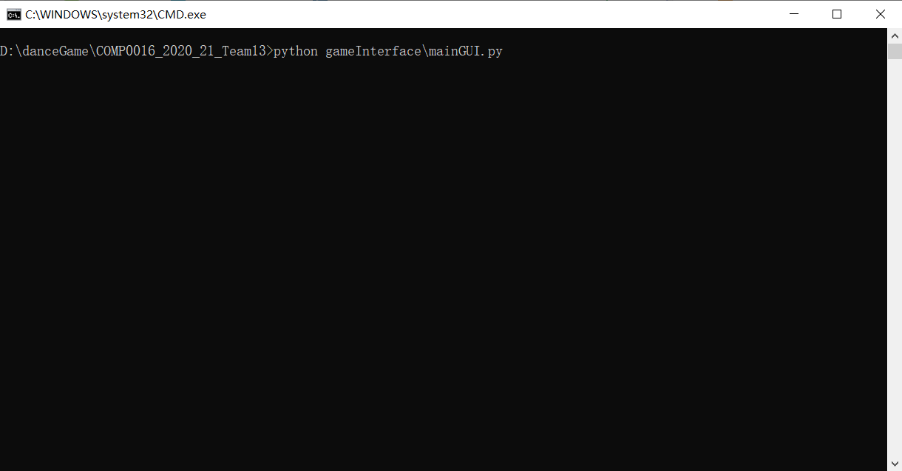
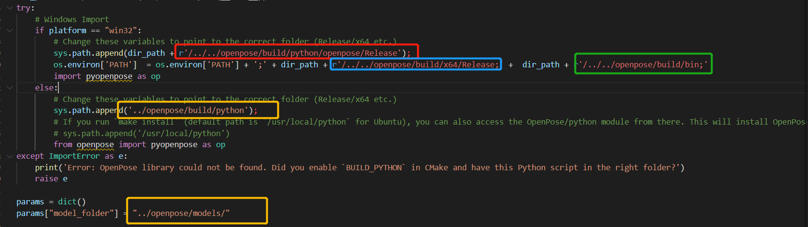
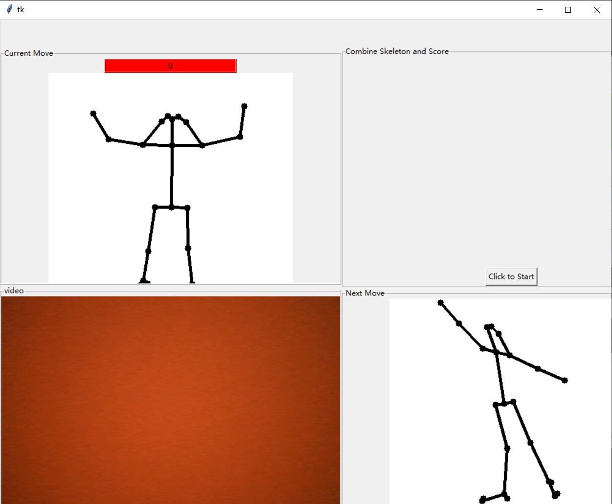
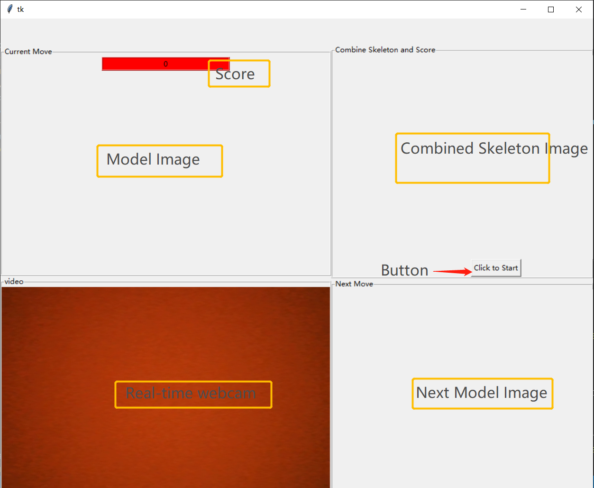

# User Maunal
- [User Maunal](#user-maunal)
  * [Important Notice](#important-notice)
  * [gameInterface folder](#gameinterface-folder)
  * [Testing folder](#testing-folder)
  * [PreprocessSkeleton folder](#preprocessskeleton-folder)
## Important Notice:
To correctly run any files that has imported team13api.py,

ALL FILES MUST RUN AT THE DIRECTORY OF COMP0016_2020_21_Team13 FOLDER:
### Win10 Example

Unless if you changed the location of openpose folder, REMEMBER to change the directory in the team13api.py, accordng to your platform

## gameInterface folder
Go to danceGame\COMP0016_2020_21_Team13\gameInterface, users can run the game by double-click the file `mainGUI.py`. Expected output:

Start the game by running it under COMP0016_2020_21_Team13 as the working directory

## Testing folder

1. IntegrationTest\scoring. Code folder holds `imageScoringTest.py` which process a list of images and output all the images with their skeleton

2. UnitTest\skeletonRecognition. Code folder holds `skeletonRecognition.py` which processes a list of pairs of images stored in data folder and output all the skeleton in a window when the program finished.

3. UnitTest\webcamTest. Code folder holds `webcamTesting.py` which turns on the webcam and show real-time video shoot by the webcam on user's computer.
##  PreprocessSkeleton folder

1. Input folder is where images need to be preprocessed are placed, remember to delete preprocessOutput folder before running `preprocessSkeleton.py`

2. `preprocessSkeleton.py`, a program that preprocess images stored at input folder, save output preprocessed files as .npz flies, create a folder called preprocessOutput and all the .npz files are stored in the preprocessOutput folder.
