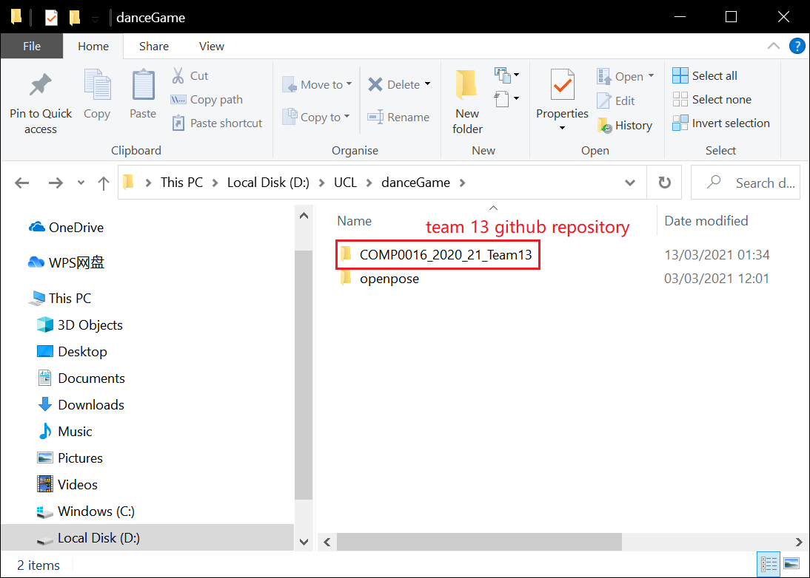

# Installation Guide For Win10

- [Installation Guide For Win10](#installation-guide-for-win10)
  * [Clone team 13 repositories](#clone-team-13-repositories)
  * [Install OpenPose](#install-openpose)
    + [Clone OpenPose repository below team 13 github repository](#clone-openpose-repository-below-team-13-github-repository)
    + [Prerequisites](#prerequisites)
    + [Cmake Configuration](#cmake-configuration)
  * [Run Openpose](#run-openpose)
  * [Run the Game](#run-the-game)

##  Clone team 13 repositories

    git clone [https://github.com/UCLComputerScience/COMP0016_2020_21_Team13](https://github.com/UCLComputerScience/COMP0016_2020_21_Team13)

(parent directory path should not be too long as windows maximum path length is 256)
##  Install OpenPose
[Official installation instructions:](https://github.com/CMU-Perceptual-Computing-Lab/openpose/blob/master/doc/installation/0_index.md)
Tools:

Python version 3.7

Visual Studio 2019 Community

CMake 3.20.0
###   Clone OpenPose repository below team 13 github repository

    git clone [https://github.com/CMU-Perceptual-Computing-Lab/openpose](https://github.com/CMU-Perceptual-Computing-Lab/openpose)

###  Prerequisites
[Openpose Official Prerequisites](https://github.com/CMU-Perceptual-Computing-Lab/openpose/blob/master/doc/installation/1_prerequisites.md)

[Install CMake GUI 3.20.0](https://cmake.org/download/)

Clone pybind11 in the openpose/3rdparty directory mentioned above.

    cd openpose/3rdparty
    git clone https://github.com/pybind/pybind11
###  Cmake Configuration

Press configure, use Visual Studio 16 2019 as generator.

Click on build python and cpu only for cpu mode:

Press "Configure" and then "Generate"

##  Run Openpose

Check OpenPose was properly installed by running any demo example: 01_body_from_image.py.

Open terminal, navigate to the path tutorial_api_python and then run 01_body_from_image.py. (or run it through visual studio code)

If openpose is properly installed, the following picture will pop out.

##  Run the Game

    cd danceGame/COMP0016_2020_21_Team13/
    
    python3 gameInterface/mainGUI.py
Expected Output:

